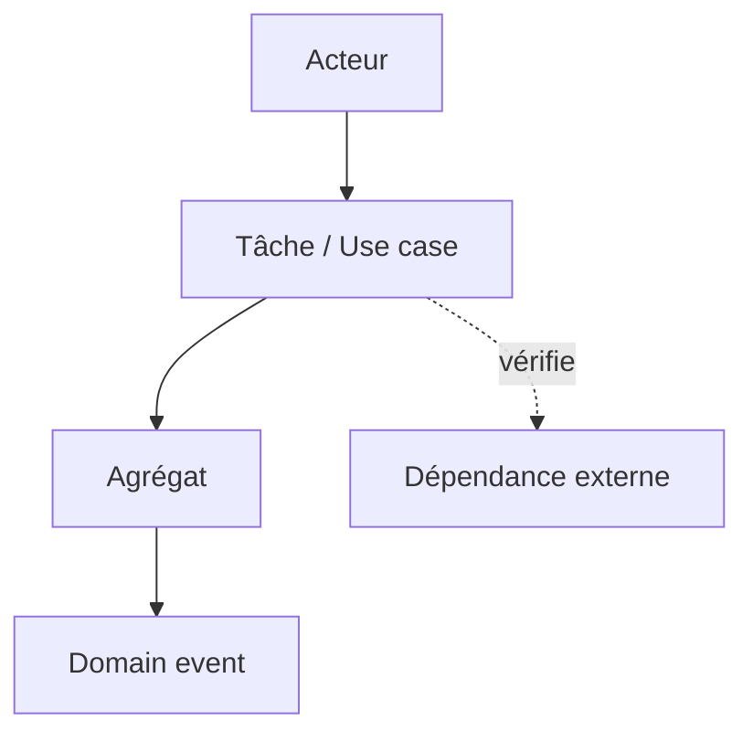

# Mermaid Template

```mermaid
flowchart TD
    Actor["Acteur"]
    Task["Tâche / Use case"]
    Aggregate["Agrégat"]
    Event["Domain event"]
    External["Dépendance externe"]

    Actor --> Task
    Task --> Aggregate
    Aggregate --> Event
    Task -. vérifie .-> External
```

